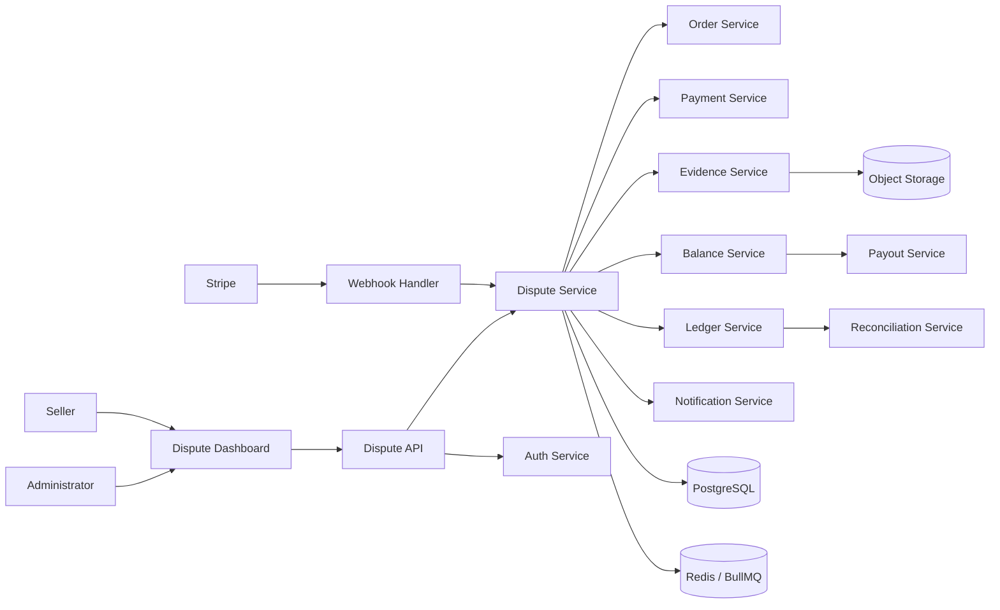
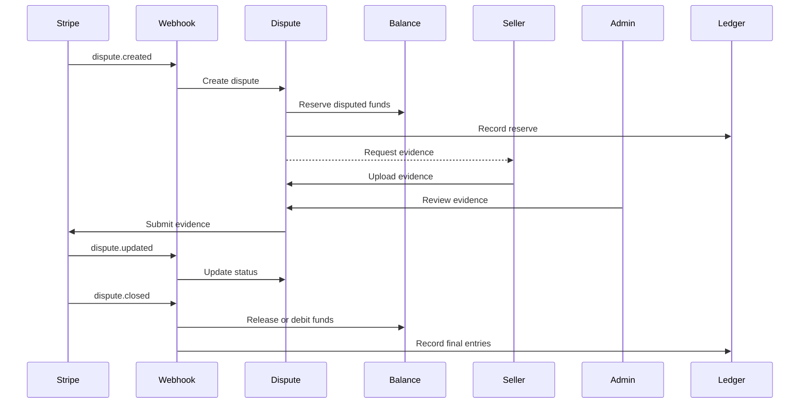
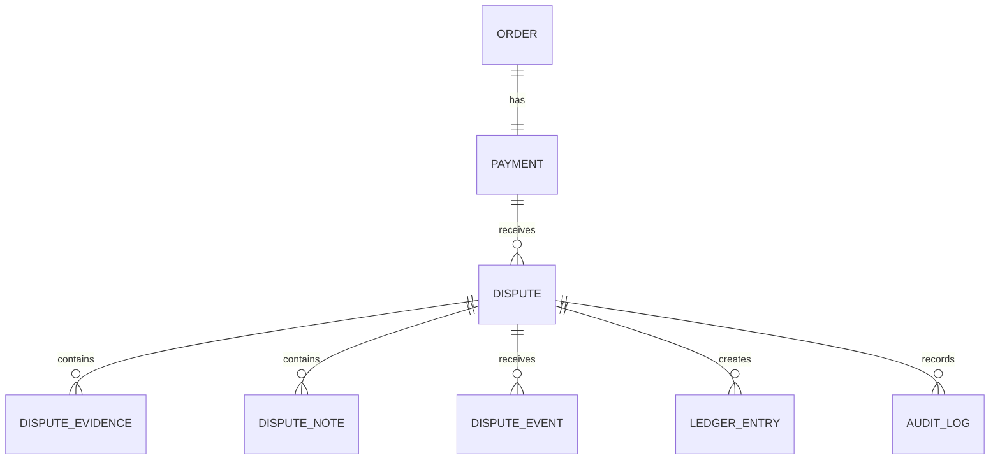
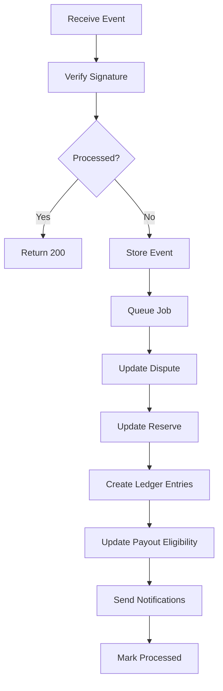

# Disputes & Chargebacks Management

> Structured architecture for managing payment disputes, chargebacks, evidence, seller balance protection, Stripe events, and reconciliation.

---

## Table of Contents

1. [Overview](#1-overview)
2. [Core Features](#2-core-features)
3. [System Architecture](#3-system-architecture)
4. [Dispute Lifecycle](#4-dispute-lifecycle)
5. [Dispute Types](#5-dispute-types)
6. [Business Rules](#6-business-rules)
7. [Financial Impact](#7-financial-impact)
8. [Evidence Management](#8-evidence-management)
9. [Data Model](#9-data-model)
10. [API Design](#10-api-design)
11. [Stripe Integration](#11-stripe-integration)
12. [Balance & Payout Protection](#12-balance--payout-protection)
13. [Webhook Processing](#13-webhook-processing)
14. [Idempotency & Concurrency](#14-idempotency--concurrency)
15. [Failure Handling](#15-failure-handling)
16. [Security & Audit](#16-security--audit)
17. [Notifications](#17-notifications)
18. [Reconciliation](#18-reconciliation)
19. [Project Structure](#19-project-structure)
20. [Environment Variables](#20-environment-variables)
21. [Testing Strategy](#21-testing-strategy)
22. [Development Roadmap](#22-development-roadmap)
23. [Design Principles](#23-design-principles)

---

## 1. Overview

The **Disputes & Chargebacks** module handles payment disputes raised by customers through their bank or card issuer.

It connects:

```text
Checkout
   │
   ▼
Payment
   │
   ▼
Dispute / Chargeback
   │
   ├── Evidence
   ├── Seller Reserve
   ├── Ledger
   ├── Stripe
   ├── Notifications
   └── Reconciliation
   │
   ▼
Final Result
├── Won
└── Lost
```

### Primary Actors

| Actor | Responsibility |
|---|---|
| Customer | Raises a dispute through the bank/card issuer |
| Seller | Provides order, delivery, and customer evidence |
| Administrator | Reviews and submits dispute responses |
| Stripe | Sends dispute events and final outcomes |
| Dispute Service | Controls dispute workflow |
| Balance Service | Reserves and adjusts seller funds |
| Ledger Service | Records financial movements |
| Payout Service | Blocks disputed funds from payout |

---

## 2. Core Features

### Dispute Management

- Automatically create disputes from Stripe webhooks
- Track amount, currency, reason, and deadline
- Assign disputes to sellers or administrators
- Track dispute status
- Accept liability when required
- Track final result: won or lost
- Add internal notes
- Escalate high-value cases

### Evidence Management

- Customer communication
- Receipt and invoice
- Product description
- Shipping tracking
- Delivery confirmation
- Refund policy
- Cancellation policy
- Service documentation
- Access or login logs
- Evidence versioning
- Evidence review before submission

### Financial Protection

- Reserve seller funds
- Protect pending payouts
- Record dispute fees
- Release reserves for won disputes
- Convert reserves into debits for lost disputes
- Recover negative seller balances
- Create immutable ledger entries

---

## 3. System Architecture

### 3.1 High-Level Architecture



### 3.2 Architecture Layers

```text
Presentation
├── Seller Dispute Dashboard
├── Admin Dispute Dashboard
├── Dispute Details
├── Evidence Panel
└── Dispute Timeline

Application
├── Create Dispute
├── Review Dispute
├── Add Evidence
├── Submit Evidence
├── Accept Liability
└── Close Dispute

Domain
├── Dispute State Machine
├── Evidence Rules
├── Deadline Rules
├── Balance Reserve Rules
├── Payout Protection Rules
└── Ledger Rules

Infrastructure
├── PostgreSQL
├── Redis
├── BullMQ
├── Stripe API
├── Object Storage
├── Email Provider
└── Logging / Monitoring
```

### 3.3 Suggested Stack

| Layer | Technology |
|---|---|
| Frontend | Next.js, React, TypeScript, Tailwind CSS |
| Backend | Node.js, TypeScript, NestJS or Express |
| Database | PostgreSQL |
| ORM | Prisma |
| Queue | Redis + BullMQ |
| Payments | Stripe |
| Storage | Amazon S3 or compatible storage |
| Validation | Zod / class-validator |
| Testing | Vitest/Jest, Supertest, Playwright |

---

## 4. Dispute Lifecycle

### 4.1 Processing Flow



### 4.2 Statuses

| Status | Meaning |
|---|---|
| `created` | Dispute created locally |
| `needs_response` | Evidence/action required |
| `collecting_evidence` | Evidence being prepared |
| `ready_for_submission` | Evidence package complete |
| `submitted` | Evidence sent to Stripe |
| `under_review` | Bank/card network reviewing |
| `won` | Merchant won |
| `lost` | Merchant lost |
| `accepted` | Liability accepted |
| `requires_action` | Manual intervention required |
| `closed` | Finalized |

### 4.3 State Machine

```text
created
└── needs_response

needs_response
├── collecting_evidence
├── accepted
└── requires_action

collecting_evidence
├── ready_for_submission
├── accepted
└── requires_action

ready_for_submission
├── submitted
└── collecting_evidence

submitted
└── under_review

under_review
├── won
├── lost
└── requires_action

won
└── closed

lost
└── closed

accepted
└── closed
```

---

## 5. Dispute Types

| Reason | Description |
|---|---|
| `fraudulent` | Unauthorized payment claim |
| `duplicate` | Duplicate charge claim |
| `product_not_received` | Product was not received |
| `product_unacceptable` | Product damaged or not as described |
| `subscription_cancelled` | Billing continued after cancellation |
| `credit_not_processed` | Expected refund not received |
| `unrecognized` | Transaction not recognized |
| `general` | Other dispute type |

---

## 6. Business Rules

### Dispute Creation

Create a dispute only when:

- Stripe webhook signature is valid
- Payment exists
- Stripe dispute ID is unique
- Event has not already been processed

### Evidence Rules

- Seller can submit evidence only for owned orders
- Admin can review all evidence
- Evidence must belong to the correct dispute
- Submitted evidence should become immutable
- Evidence submitted after the deadline should be blocked
- Internal notes must never be included in external evidence

### Deadline Rules

Track:

```text
stripe_evidence_due_by
admin_review_due_by
seller_evidence_due_by
```

Recommended structure:

```text
Stripe Deadline
      │
      ▼
Admin Review Deadline
      │
      ▼
Seller Evidence Deadline
```

---

## 7. Financial Impact

### Exposure Formula

```text
Total Dispute Exposure
=
Disputed Amount
+ Dispute Fee
+ Risk Reserve
```

Example:

```text
Disputed amount: $120.00
Dispute fee:      $15.00
Risk reserve:     $25.00
------------------------
Total exposure:  $160.00
```

### Won Dispute

```text
Reserve:         -$120.00
Dispute won
Reserve release: +$120.00
Final loss:         $0.00
```

### Lost Dispute

```text
Disputed amount: -$120.00
Dispute fee:      -$15.00
Final impact:    -$135.00
```

### Negative Balance

```text
Seller balance:   $50.00
Dispute impact: -$135.00
New balance:     -$85.00
```

---

## 8. Evidence Management

### Evidence Categories

```text
customer_communication
customer_name
customer_email
billing_address
shipping_address
receipt
invoice
product_description
refund_policy
cancellation_policy
shipping_tracking
delivery_confirmation
service_documentation
access_logs
login_history
ip_address
device_information
other
```

### Evidence Structure

```text
Evidence Package
├── Transaction
├── Customer
├── Order
├── Fulfillment
├── Communication
├── Refund Policy
├── Cancellation Policy
├── Tracking / Delivery
├── Service Proof
└── Timeline
```

### Versioning

```text
Draft v1
   │
   ▼
Review
   │
   ▼
Draft v2
   │
   ▼
Approved
   │
   ▼
Submitted Snapshot
```

---

## 9. Data Model

### Entity Relationship



### `Dispute`

```text
id
stripeDisputeId
paymentId
orderId
sellerId
stripeChargeId
amount
currency
reason
status
networkReasonCode
evidenceDueBy
sellerEvidenceDueBy
submittedAt
wonAt
lostAt
acceptedAt
closedAt
createdAt
updatedAt
```

### `DisputeEvidence`

```text
id
disputeId
type
value
fileUrl
fileKey
fileType
fileSize
version
submittedToStripe
createdBy
createdAt
updatedAt
```

### `DisputeNote`

```text
id
disputeId
authorId
authorRole
content
visibility
createdAt
updatedAt
```

### `DisputeEvent`

```text
id
disputeId
stripeEventId
type
payload
processedAt
createdAt
```

### `LedgerEntry`

```text
id
sellerId
paymentId
disputeId
payoutId
type
amount
currency
balanceAfter
reference
metadata
createdAt
```

---

## 10. API Design

| Method | Endpoint | Access | Purpose |
|---|---|---|---|
| `GET` | `/api/seller/disputes` | Seller | List disputes |
| `GET` | `/api/seller/disputes/:id` | Seller | View dispute |
| `POST` | `/api/seller/disputes/:id/evidence` | Seller | Add evidence |
| `GET` | `/api/admin/disputes` | Admin | List all disputes |
| `GET` | `/api/admin/disputes/:id` | Admin | View dispute |
| `POST` | `/api/admin/disputes/:id/assign` | Admin | Assign case |
| `POST` | `/api/admin/disputes/:id/evidence` | Admin | Add evidence |
| `POST` | `/api/admin/disputes/:id/submit` | Admin | Submit evidence |
| `POST` | `/api/admin/disputes/:id/accept` | Admin | Accept liability |
| `POST` | `/api/admin/disputes/:id/notes` | Admin | Add note |
| `POST` | `/api/webhooks/stripe` | Stripe | Process events |

### Example Response

```json
{
  "id": "dispute_123",
  "stripeDisputeId": "dp_123",
  "orderId": "order_123",
  "paymentId": "payment_123",
  "amount": 12000,
  "currency": "usd",
  "reason": "product_not_received",
  "status": "needs_response",
  "evidenceDueBy": "2026-08-10T23:59:59.000Z"
}
```

---

## 11. Stripe Integration

### Retrieve Dispute

```ts
const dispute = await stripe.disputes.retrieve(
  disputeRecord.stripeDisputeId
);
```

### Submit Evidence

```ts
await stripe.disputes.update(
  disputeRecord.stripeDisputeId,
  {
    evidence: {
      customer_name: evidence.customerName,
      customer_email_address: evidence.customerEmail,
      product_description: evidence.productDescription,
      shipping_tracking_number: evidence.trackingNumber
    },
    submit: true
  }
);
```

### Accept Liability

```ts
await stripe.disputes.close(
  disputeRecord.stripeDisputeId
);
```

### Integration Rules

- Stripe dispute ID must be unique
- Store Stripe event IDs
- Validate current state before submission
- Store submitted evidence snapshots
- Use webhook events for final outcomes
- Keep internal and external statuses clearly mapped

---

## 12. Balance & Payout Protection

### Reserve Example

```text
Available balance:       $500.00
Dispute reserve:        -$120.00
Payout-eligible balance: $380.00
```

### Reserve Lifecycle

```text
created             → reserve
needs_response      → keep reserve
collecting_evidence → keep reserve
submitted           → keep reserve
under_review        → keep reserve
won                 → release reserve
lost                → convert to debit
accepted            → convert to debit
closed              → reconcile
```

### Payout Formula

```text
Payout Eligible
=
Available Balance
- Refund Reserve
- Dispute Reserve
- Risk Reserve
- Pending Adjustments
```

### Ledger Entry Types

```text
dispute_reserve
dispute_reserve_release
dispute_debit
dispute_fee
dispute_reversal_credit
payout_hold
payout_hold_release
manual_dispute_adjustment
```

---

## 13. Webhook Processing

### Relevant Events

```text
charge.dispute.created
charge.dispute.updated
charge.dispute.closed
charge.dispute.funds_withdrawn
charge.dispute.funds_reinstated
```

### Pipeline



---

## 14. Idempotency & Concurrency

### Idempotency Keys

```text
dispute:create:{stripeDisputeId}
dispute:evidence:{disputeId}:{version}
dispute:reserve:{disputeId}
dispute:debit:{disputeId}
dispute:release:{disputeId}
```

Protect against:

- Duplicate webhooks
- Duplicate balance movements
- Concurrent evidence submissions
- Concurrent payout and dispute jobs
- Duplicate reserve release
- Duplicate final debit

---

## 15. Failure Handling

### Common Failures

- Stripe API unavailable
- Deadline expired
- Invalid evidence
- Missing payment
- Duplicate dispute
- Database error
- Out-of-order webhook
- Evidence file missing
- Dispute already closed

### Recovery Flow

```text
Failure
  │
  ├── Preserve event
  ├── Preserve state
  ├── Store reason
  ├── Prevent duplicate finance actions
  ├── Retry transient failures
  ├── Escalate manual cases
  └── Write audit log
```

---

## 16. Security & Audit

### Security

- Authentication required
- Role-based authorization
- Seller ownership checks
- Strong admin access controls
- Stripe webhook signature verification
- Private evidence storage
- Signed file URLs
- Input sanitization
- Upload validation
- Encryption at rest
- Rate limiting

### Audit Events

```text
dispute_created
dispute_assigned
dispute_status_changed
dispute_evidence_added
dispute_evidence_removed
dispute_evidence_approved
dispute_evidence_submitted
dispute_liability_accepted
dispute_won
dispute_lost
dispute_reserve_created
dispute_reserve_released
dispute_balance_debited
dispute_manual_override
```

---

## 17. Notifications

### Events

```text
dispute_created
dispute_needs_response
dispute_evidence_due_soon
dispute_ready_for_submission
dispute_submitted
dispute_under_review
dispute_won
dispute_lost
dispute_requires_action
dispute_closed
```

### Deadline Alerts

```text
7 days before
3 days before
24 hours before
6 hours before
```

---

## 18. Reconciliation

### Reconciliation Chain

```text
Payment
  ↕
Charge
  ↕
Dispute
  ↕
Balance Transaction
  ↕
Seller Balance
  ↕
Ledger
  ↕
Payout
```

### Results

```text
MATCHED
MISSING_LOCAL_RECORD
MISSING_STRIPE_RECORD
AMOUNT_MISMATCH
STATUS_MISMATCH
LEDGER_MISMATCH
BALANCE_MISMATCH
REQUIRES_REVIEW
```

---

## 19. Project Structure

```text
src/
├── app/
│   ├── seller/
│   │   └── disputes/
│   ├── admin/
│   │   └── disputes/
│   └── api/
│       ├── disputes/
│       └── webhooks/
│
├── components/
│   └── disputes/
│       ├── DisputeList.tsx
│       ├── DisputeStatusBadge.tsx
│       ├── DisputeTimeline.tsx
│       ├── DisputeEvidencePanel.tsx
│       ├── EvidenceUploader.tsx
│       ├── DisputeDeadline.tsx
│       └── DisputeReviewPanel.tsx
│
├── modules/
│   ├── disputes/
│   │   ├── application/
│   │   │   ├── create-dispute.ts
│   │   │   ├── add-evidence.ts
│   │   │   ├── submit-evidence.ts
│   │   │   ├── accept-dispute.ts
│   │   │   └── close-dispute.ts
│   │   ├── domain/
│   │   │   ├── dispute.entity.ts
│   │   │   ├── dispute-status.ts
│   │   │   ├── dispute-policy.ts
│   │   │   ├── evidence-policy.ts
│   │   │   └── dispute-errors.ts
│   │   ├── infrastructure/
│   │   │   ├── dispute.repository.ts
│   │   │   ├── stripe-dispute.gateway.ts
│   │   │   └── dispute.mapper.ts
│   │   └── presentation/
│   │       ├── dispute.controller.ts
│   │       ├── dispute.schemas.ts
│   │       └── dispute.presenter.ts
│   ├── balances/
│   ├── ledger/
│   ├── payouts/
│   ├── notifications/
│   └── reconciliation/
│
├── workers/
│   ├── dispute-webhook.worker.ts
│   ├── dispute-deadline.worker.ts
│   ├── dispute-notification.worker.ts
│   └── dispute-reconciliation.worker.ts
│
├── lib/
│   ├── database.ts
│   ├── redis.ts
│   ├── stripe.ts
│   ├── storage.ts
│   ├── logger.ts
│   └── money.ts
│
└── tests/
    ├── unit/
    ├── integration/
    └── e2e/
```

---

## 20. Environment Variables

```env
NODE_ENV=development
APP_URL=http://localhost:3000
JWT_SECRET=

DATABASE_URL=
REDIS_URL=

STRIPE_SECRET_KEY=
STRIPE_WEBHOOK_SECRET=

DISPUTE_INTERNAL_DEADLINE_BUFFER_DAYS=2
DISPUTE_SELLER_DEADLINE_BUFFER_DAYS=4
DISPUTE_MAX_RETRY_ATTEMPTS=5
DISPUTE_AUTO_RESERVE_ENABLED=true
DISPUTE_HIGH_VALUE_THRESHOLD=50000

STORAGE_BUCKET=
STORAGE_REGION=
STORAGE_ACCESS_KEY=
STORAGE_SECRET_KEY=

EMAIL_FROM=
EMAIL_PROVIDER_API_KEY=
```

---

## 21. Testing Strategy

### Unit Tests

- State transitions
- Deadline calculations
- Evidence validation
- Reserve calculation
- Payout eligibility
- Ledger generation
- Won/lost balance logic

### Integration Tests

- Dispute creation from webhook
- Duplicate event handling
- Evidence submission
- Reserve creation/release
- Lost dispute debit
- Stripe status synchronization
- Reconciliation

### End-to-End Tests

- New dispute received
- Seller submits evidence
- Admin submits evidence to Stripe
- Dispute won
- Dispute lost
- Payout excludes reserve
- Closed dispute is immutable

---

## 22. Development Roadmap

### Phase 1 — Foundation

- Dispute models
- Stripe dispute webhooks
- Status tracking
- Seller/admin dashboard

### Phase 2 — Evidence

- Evidence storage
- Upload validation
- Seller submission
- Admin review
- Deadline management
- Stripe evidence submission

### Phase 3 — Financial Protection

- Seller reserve
- Payout hold
- Dispute fees
- Won/lost adjustments
- Ledger integration

### Phase 4 — Reliability

- Idempotency
- Concurrency protection
- Retry workers
- Dead-letter queue
- Reconciliation
- Monitoring

### Phase 5 — Production

- Risk scoring
- High-value escalation
- Reporting
- SLA monitoring
- Audit exports
- Automated tests

---

## 23. Design Principles

1. **Stripe webhooks are the external source of truth.**
2. **Active disputes must reduce payout-eligible balances.**
3. **Submitted evidence must be immutable and versioned.**
4. **Every financial movement must create a ledger entry.**
5. **Deadlines must be tracked as domain data.**
6. **All financial operations must be idempotent.**
7. **Refund, dispute, and payout reserves must share one financial state.**
8. **Failures must be recoverable and auditable.**

---

## License

This project is intended for educational, demonstration, and architecture prototyping purposes.
